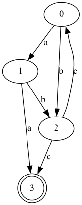
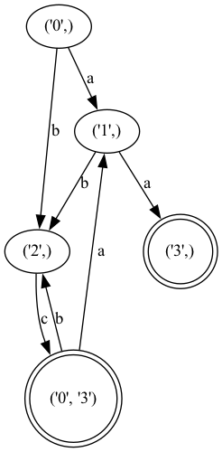

# Laboratory work nr. 2

### Course: Formal Languages & Finite Automata
### Author: Frunze Vladislav
### Group: FAF-212

----

## Theory
Definitions:
* Automaton - an abstract, or in other words, imaginary computational device, which can be used for describing systems that have a finite amount of possible states and transitions.
* Grammar - an entity defined by four elements: the set of non-terminal symbols, the set of terminal symbols, the start symbol, and the set of production rules.
* Finite automaton - an automaton with a finite amount of memory, that is, it has a limited amount of states and transitions. In addition, like a grammar, it is constituted of several elements: the finite set of states, an alphabet, a transition function, the initial state, and a set of final states.
* Deterministic finite automaton - a finite automaton that can go with the same transition at most to one state.
* Non-deterministic finite automaton - a finite automaton that can go with the same transition to multiple states.

* Where we can use an automaton?:
<br/>Modeling and simulation
<br/>Language recognition
<br/>Compiler design
<br/>Verification of systems

* Chomsky hierarchy:
<br/>Type 0. Recursively Enumerable Grammar
<br/>You don't have restrictions on productions.
<br/>Type 1. Context-Sensitive Grammars
<br/>On the right-side part of a production there cannot be an empty string (epsilon).
<br/>Type 2. Context-Free Grammar
<br/>On the left-side part of a production there can be just one non-terminal symbol.
<br/>Type 3. Regular Grammar
<br/>On the left-side part of a production there can be just one non-terminal symbol. Moreover, there can be at most one non-terminal on the right side and all of them have to be either on the right or left margin.

* Conversion of a finite automaton to a regular grammar:
<br/>1. Equalize the set of non-terminal symbols with the set of states.
<br/>2. Equalize the set of terminal symbols with the set of transitions.
<br/>3. Initialize the starting state (usually the q0 state).
<br/>4. Create the production set by eliminating the final state from the delta set, and giving each production the corresponding form for the regular grammar.

* Conversion of an NDFA to a DFA:
<br/>1. Create the new set of states, and initialize it with the starting state.
<br/>2. Look through the transitions of the starting state.
<br/>3. Identify those that are the same, and re-write it accordingly in the new delta set.
<br/>4. Remember the newly formed states, when writing the transitions for the previous state, and use it as the future states to check.
<br/>5. Do 2-4 until you don't have any more new states.


## Objectives:
* To understand what an automaton is and what can it be used for.
* To accomplish the given tasks:
<br/>1. Provide a function in your grammar type/class that could classify the grammar based on the Chomsky hierarchy. 
<br/>2. Implement conversion of a finite automaton to a regular grammar.
<br/>3. Determine whether your FA is deterministic or non-deterministic.
<br/>4. Implement some functionality that would convert an NDFA to a DFA.
<br/>5. Represent the finite automaton graphically.
<br/>6. Show the executions, in a "Main" class/type.
<br/>7. Write the report.


## Implementation description
#### My finite automaton (variant 11):
```
Q = {q0,q1,q2,q3},
∑ = {a,b,c},
F = {q3},
δ(q0,a) = q1,
δ(q1,b) = q2,
δ(q2,c) = q0,
δ(q1,a) = q3,
δ(q0,b) = q2,
δ(q2,c) = q3.
```

#### Grammar method which classifies the grammar based on Chomsky's hierarchy.
Firstly, we identify if the grammar is of the type 0 or 1, which happens if the left-side part of at least one production has more than one symbol. If the last is true, we look if the right-side part of a production has an epsilon, which would tell that the grammar is of type 0, otherwise is of type 1. Lastly, if the grammar is not of type 0 or 1, it means that it is of type 2 or 3, which suggests looking at the right-side part of productions for irregularities from Regular grammar. By irregularities, I mean the non-terminals of the right-side part of all productions would not be either on the left or right margins, and the number of non-terminals would exceed 1, which would suggest that we have a type 2 grammar, otherwise a type 3 grammar.

```
        for key in self.P.keys():
            if len(key) != 1:
                type_0_or_1 = True
                break
        if type_0_or_1 == True:
            for key in self.P.keys():
                for value in self.P[key]:
                    if value == '':
                        return 'Type 0. Recursively Enumerable Grammar'
            return 'Type 1. Context-Sensitive Grammar'

        if type_0_or_1 == False:
            for key in self.P.keys():
                for value in self.P[key]:
                    for index, symbol in enumerate(value):
                        if symbol in self.V_n and len(value) != 1:
                            if index == 0:
                                left_RG = True
                                if right_RG:
                                    return 'Type 2. Context-Free Grammar'
                            elif index == len(value) - 1:
                                right_RG = True
                                if left_RG:
                                    return 'Type 2. Context-Free Grammar'
                            else:
                                return 'Type 2. Context-Free Grammar'
            return 'Type 3. Regular Grammar'
```


#### FA method that converts a finite automaton to a regular grammar.
In order to convert an FA to an RG, we need to define the non-terminal set to be equal to the set of states of the FA, the set of terminals to be equal to the alphabet (transitions) of the FA, the starting non-terminal symbol "S", we define to be equal to the starting state q0. Next, we create the production dictionary, by eliminating the final states from the delta transitions and re-writing the transitions in an acceptable form for an RG in the production dictionary. After, we return the grammar object with the defined above data.

```
        V_n = self.Q
        V_t = self.sigma
        S = self.q0
        P = {}
        for key in self.delta.keys():
            for production in self.delta[key]:
                if key not in P:
                    P[key] = []
                if production[1] in self.F:
                    P[key].append(production[0])
                else:
                    P[key].append(production[0] + production[1])
        return grammar.Grammar(V_n, V_t, P, S)
```

#### FA method that determines if the FA is deterministic or non-deterministic.
We can check if an FA is deterministic or non-deterministic by looking at one aspect of the FA, if the FA has a state which can go to more than one state with the same symbol from the sigma alphabet (transition), then it is an NDFA, otherwise, it is a DFA. Thus, for each transition function of a state in the delta dictionary, we check if at least one sigma symbol will be the same for two transition functions. If this happens for at least one state of the delta dictionary, the program returns NDFA, otherwise DFA.

```
        for key in self.delta.keys():
            for i in range(len(self.delta[key])):
                for j in range(i + 1, len(self.delta[key])):
                    if self.delta[key][i][0] == self.delta[key][j][0]:
                        return 'NDFA'
        return 'DFA'
```


#### FA method that converts an NDFA to a DFA.
In order to convert an NDFA to a DFA, we have to look at the transition functions of each new state beginning with starting state from the present delta dictionary. If the state can go to another state with the same sigma symbol (transition), then we write it in the new "DFA_delta" dictionary, for example, like in the following form "('0',): [('c', ('0', '3'))]", where "0" is the starting state, "c" the transition symbol, "0", "3" the states where the "0 state can go to with "c". If the state doesn't have such transitions, then we write it in the "DFA_delta" dictionary as usual like in the following form "('0',): [('c', ('3',))]". While doing this, we remember in the new state set the new states that were formed in the previous step. After, we do the same thing with the new states, until there won't be other new possible states to check. Finally, we re-set the previous attributes of the NDFA with the DFA attributes like "self.delta = DFA_delta".

```
        self.q0 = (self.q0,)
        Qn.append(self.q0)

        for state in Qn:
            for transition in self.sigma:
                new_state = ()
                for sub_state in state:
                    if sub_state in self.delta:
                        for production in self.delta[sub_state]:
                            if transition == production[0]:
                                new_state += (production[1],)
                        if new_state not in Qn and new_state != ():
                            Qn.append(new_state)
                if new_state != ():      
                    if state in DFA_delta:
                        DFA_delta[state].append((transition, new_state))
                    else:
                        DFA_delta[state] = [(transition, new_state)]
                        
        self.Q = Qn
        self.delta = DFA_delta
        final_state = []
        for state in self.delta.keys():
            if self.F in state:
                final_state.append(state)
        if self.F not in self.delta:
            final_state.append((self.F,))
        self.F = final_state
```


#### FA method that represents the finite automaton graphically.
For this task, we can use the "graphviz" library. First, we import it, then we create a new graph. After, we can add the nodes, the keys of our delta dictionary, to the graph. While doing this, we identify the final states and mark them to be in a double circle. Next, we add the edges to the graph with the corresponding "graphviz" method. Then, we create the graph by using the "render" method, which would output our image with the graph.

```
        graph = graphviz.Digraph()

        for state in self.delta.keys():
            if state in self.F:
                graph.node(str(state), shape='doublecircle')
            else:
                graph.node(str(state))
            for next_state in self.delta[state]:
                if next_state[1] in self.F:
                    graph.node(str(next_state[1]), shape='doublecircle')

        for state in self.delta.keys():
            for transition, next_state in self.delta[state]:
                graph.edge(str(state), str(next_state), label=transition)

        graph.render('finite_automaton', format='png', view=True)
```

<table style="border-collapse: collapse;">
  <tr>
    <td style="border: none;">
      <div>
        
        <figcaption style="text-align: center;">Figure 1: The NDFA of my variant</figcaption>
      </div>
    </td>
    <td style="border: none;">
      <div>
        
        <figcaption style="text-align: center;">Figure 2: The DFA of my variant</figcaption>
      </div>
    </td>
  </tr>
</table>


#### The "main" file.
```
import grammar
import finite_automaton as FA

V_n = ['S', 'B', 'D']
V_t = ['a', 'b', 'c']
P = {
    'S': ['aB', 'bB'],
    'B': ['bD', 'cB', 'aS'],
    'D': ['b', 'aD']
}
grammar_11 = grammar.Grammar(V_n, V_t, P, 'S')
print(grammar_11.classify_grammar())

Q = ['0', '1', '2', '3']
sigma = ['a', 'b', 'c']
F = '3'
delta = {
    '0': [('a', '1'), ('b', '2')], 
    '1': [('b', '2'), ('a', F)],
    '2': [('c', '0'), ('c', F)]
}
FA_11 = FA.Finite_Automaton(Q, sigma, delta, '0', F)
FA_11.show_graphically()

RG = FA_11.FA_to_RG()
print('\n')
print("V_n = ", RG.V_n)
print("V_t = ", RG.V_t)
print("S = ", RG.S)
print("P = ", RG.P, '\n')

print(FA_11.get_type())
FA_11.convert_to_DFA()
print(FA_11.get_type(), "\n")

print("Q = ", FA_11.Q)
print("sigma = ", FA_11.sigma)
print("delta = ", FA_11.delta)
print("q0 = ", FA_11.q0)
print("F = ", FA_11.F)
```


## Conclusions / Screenshots / Results
### Results:
Result 1: Classification of the grammar from lab. 1 with the "classify_grammar" method.
```
Type 3. Regular Grammar
```


Result 2: Converted FA to RG
```
V_n = ['0', '1', '2', '3']
V_t = ['a', 'b', 'c']
S = '0'
P = {'0': ['a1', 'b2'], '1': ['b2', 'a'], '2': ['c0', 'c']}
```


Result 3: The type of my FA before and after method "convert_to_DFA()", using method "get_type()" for output.
```
NDFA
DFA
```


Result 4: Converted NDFA to DFA
```
Q = [('0',), ('1',), ('2',), ('3',), ('0', '3')]
sigma = ['a', 'b', 'c']
delta = {
    ('0',): [('a', ('1',)), ('b', ('2',))], 
    ('1',): [('a', ('3',)), ('b', ('2',))], 
    ('2',): [('c', ('0', '3'))], 
    ('0', '3'): [('a', ('1',)), ('b', ('2',))]
    }
q0 = ('0',)
F = [('0', '3'), ('3',)]
```


Result 5: Graphical representation of FAs
<table style="border-collapse: collapse;">
  <tr>
    <td style="border: none;">
      <div>
        
        <figcaption style="text-align: center;">The NDFA of variant 11</figcaption>
      </div>
    </td>
    <td style="border: none;">
      <div>
        
        <figcaption style="text-align: center;">The DFA of variant 11</figcaption>
      </div>
    </td>
  </tr>
</table>


### Conclusions
* The classification of the grammars can be easily done by identifying the criteria for each grammar.
* The conversion of a FA to an RG can be done mostly by attributing.
* The conversion of an NDFA to a DFA can be tricky, however, if you use the analytical algorithm this can be done in a nested "for" loop.
* In order to represent the FAs, we can choose one of the libraries like "graphviz" that allow a very intuitive construction of a graph.
* All in all, an automaton seems to be an important and useful concept.

## References
* Cojuhari I., Duca L., & Fiodorov I. Formal Languages and Finite Automata Guide for practical lessons. Technical University of Moldova